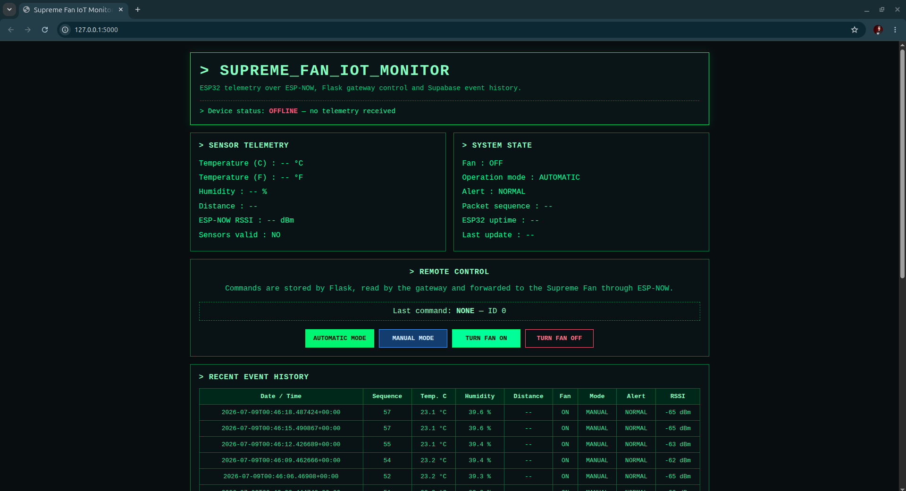
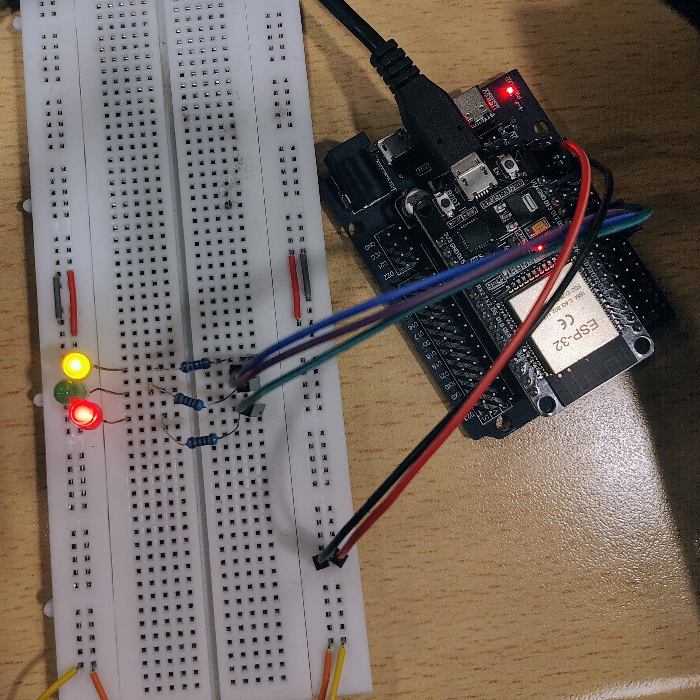
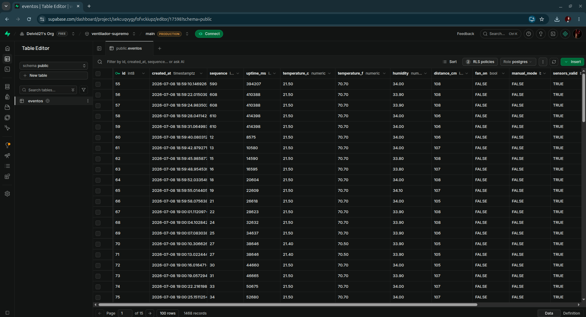

# Sistema IoT Ventilador Supremo

**Asignatura:** DCSH01 - Desarrollo de Software para Hardware  
**Evaluación:** Evaluación Sumativa 3  
**Institución:** Universidad Tecnológica de Chile INACAP / Centro de Formación Técnica

**Desarrollado por:** Cristian Muena / David Parra Acuña (Deivid21)

---

## 1. Descripción general del proyecto

Este proyecto implementa un sistema IoT de monitoreo y control utilizando dos tarjetas ESP32, ESP-NOW, WiFi, Flask y Supabase.

La primera ESP32 corresponde al **nodo Ventilador Supremo**. Esta tarjeta mide temperatura, humedad y distancia, controla localmente el ventilador y muestra información del sistema en una pantalla LCD.

La segunda ESP32 corresponde al **nodo Receptor/Gateway**. Esta tarjeta recibe la telemetría mediante ESP-NOW, reenvía los datos a un backend Flask mediante HTTP y devuelve comandos remotos al Ventilador Supremo.

Flask almacena la telemetría en Supabase y muestra un panel web con estilo de terminal que funciona sin JavaScript.



---

## 2. Objetivos del sistema

Los principales objetivos del proyecto son:

- Leer temperatura y humedad mediante un sensor DHT22.
- Medir distancia mediante un sensor ultrasónico HC-SR04.
- Controlar físicamente un ventilador o motor DC.
- Permitir modos de funcionamiento automático y manual.
- Enviar telemetría entre tarjetas ESP32 mediante ESP-NOW.
- Detectar automáticamente el canal WiFi utilizado por el gateway.
- Reenviar la telemetría desde el gateway hacia Flask mediante HTTP.
- Guardar los eventos de telemetría en Supabase.
- Mostrar el estado actual y el historial reciente en un panel web.
- Enviar comandos remotos desde Flask al Ventilador Supremo.
- Utilizar un dashboard sin JavaScript.

---

## 3. Arquitectura del sistema

```text
┌──────────────────────────────────────┐
│ ESP32 1 - VENTILADOR SUPREMO         │
│                                      │
│ DHT22                                │
│ HC-SR04                              │
│ LCD 16x2 I2C                         │
│ Botón local                          │
│ Ventilador / motor DC                │
│ LEDs de estado                       │
│                                      │
│ Control automático y manual local    │
└──────────────────┬───────────────────┘
                   │
                   │ ESP-NOW
                   │ Telemetría y comandos
                   ▼
┌──────────────────────────────────────┐
│ ESP32 2 - RECEPTOR / GATEWAY         │
│                                      │
│ Recibe telemetría por ESP-NOW        │
│ Controla LEDs de estado              │
│ Se conecta a la red WiFi de 2.4 GHz  │
│ Envía solicitudes HTTP a Flask       │
│ Devuelve comandos mediante ESP-NOW   │
└──────────────────┬───────────────────┘
                   │
                   │ WiFi / HTTP
                   ▼
┌──────────────────────────────────────┐
│ BACKEND FLASK                        │
│                                      │
│ POST /api/datos                      │
│ GET  /api/comando                    │
│ GET  /api/estado                     │
│ POST /comando                        │
│ GET  /                               │
└──────────────────┬───────────────────┘
                   │
                   │ API REST de Supabase
                   ▼
┌──────────────────────────────────────┐
│ SUPABASE / POSTGRESQL                │
│                                      │
│ Tabla: eventos                       │
│ Telemetría y marcas de tiempo        │
└──────────────────────────────────────┘
```


## 4. Función de cada tarjeta ESP32

### ESP32 1 - Nodo Ventilador Supremo

Esta tarjeta se encarga de:

- Leer el sensor DHT22.
- Leer el sensor ultrasónico HC-SR04.
- Controlar el ventilador o motor DC.
- Gestionar el modo automático.
- Gestionar el modo manual.
- Leer el botón de control local.
- Mostrar información en la pantalla LCD.
- Enviar telemetría mediante ESP-NOW.
- Recibir comandos remotos mediante ESP-NOW.
- Buscar automáticamente el canal WiFi hasta encontrar el gateway.

El nodo Ventilador Supremo no necesita acceso directo a Internet. Su comunicación se realiza exclusivamente con el gateway mediante ESP-NOW.


### ESP32 2 - Receptor y gateway

Esta tarjeta se encarga de:

- Recibir la telemetría del Ventilador Supremo.
- Detectar automáticamente la dirección MAC del Ventilador Supremo.
- Enviar una confirmación con el canal WiFi activo.
- Conectarse a la red WiFi local.
- Enviar la telemetría a Flask mediante HTTP POST.
- Consultar comandos desde Flask mediante HTTP GET.
- Reenviar los comandos al Ventilador Supremo mediante ESP-NOW.
- Mostrar el estado del sistema mediante LEDs verde, rojo y azul.



---

## 5. Flujo de comunicación

El flujo completo del sistema es el siguiente:

1. El nodo Ventilador Supremo lee los sensores DHT22 y HC-SR04.
2. El nodo aplica la lógica local de control automático o manual.
3. Busca el gateway ESP-NOW recorriendo automáticamente los canales WiFi.
4. El gateway recibe el paquete de telemetría.
5. El gateway responde con una confirmación que incluye el canal activo.
6. El Ventilador Supremo permanece enlazado a ese canal.
7. El gateway envía la telemetría a Flask mediante `POST /api/datos`.
8. Flask actualiza el estado actual del sistema.
9. Flask almacena el evento de telemetría en Supabase.
10. El dashboard muestra el estado actual y el historial reciente.
11. El gateway consulta el último comando mediante `GET /api/comando`.
12. El gateway reenvía los comandos nuevos mediante ESP-NOW.
13. El Ventilador Supremo ejecuta el comando recibido.

### Comandos remotos

| Comando | Función |
|---|---|
| `AUTO` | Activa el modo automático |
| `MANUAL` | Activa el modo manual |
| `FAN_ON` | Activa el modo manual y enciende el ventilador |
| `FAN_OFF` | Activa el modo manual y apaga el ventilador |

---

## 6. Paquete de telemetría

El gateway envía a Flask una estructura JSON como la siguiente:

```json
{
  "sequence": 15,
  "uptime_ms": 32500,
  "temperature_c": 26.4,
  "temperature_f": 79.5,
  "humidity": 51.2,
  "distance_cm": 8,
  "fan_on": true,
  "manual_mode": false,
  "sensors_valid": true,
  "alert_active": true,
  "rssi": -42
}
```

Flask devuelve el último comando remoto usando:

```json
{
  "command": "FAN_ON",
  "command_id": 1
}
```

El campo `command_id` evita que un mismo comando se ejecute repetidamente.

---

## 7. Estructura del repositorio

```text
.
├── app.py
├── arduino-fw
│   ├── gateway
│   │   └── gateway.ino
│   └── ventilador_supremo_espnow
│       └── ventilador_supremo_espnow.ino
├── images
│   ├── complete-project.png
│   ├── receiver-gateway.jpg
│   ├── supabase-table.png
│   └── supreme-fan-node.jpg
├── README.md
├── supabase
│   └── eventos.sql
└── templates
    └── dashboard.html

```

---

## 8. Requisitos de hardware

- 2 tarjetas ESP32 DevKit.
- 1 sensor de temperatura y humedad DHT22.
- 1 sensor ultrasónico HC-SR04.
- 1 pantalla LCD 16x2 I2C.
- 1 pulsador.
- 1 motor DC o ventilador.
- 1 controlador de motor o puente H.
- 2 LEDs locales para el nodo Ventilador Supremo.
- 3 LEDs de estado para el receptor/gateway.
- Resistencias de 220 ohm para los LEDs.


## 9. Configuración de pines

### Nodo Ventilador Supremo

| Componente | Pin ESP32 |
|---|---:|
| Datos DHT22 | GPIO 4 |
| Trigger HC-SR04 | GPIO 5 |
| Echo HC-SR04 | GPIO 18 |
| LED local 1 | GPIO 2 |
| LED local 2 | GPIO 15 |
| Entrada 1 del motor | GPIO 17 |
| Entrada 2 del motor | GPIO 19 |
| Botón local | GPIO 14 |
| SDA LCD | Pin SDA I2C predeterminado de la ESP32 |
| SCL LCD | Pin SCL I2C predeterminado de la ESP32 |

> Verificar la dirección I2C de la pantalla LCD. El firmware actual utiliza `0x27`.

### Receptor gateway

| Componente | Pin ESP32 |
|---|---:|
| LED verde | GPIO 25 |
| LED rojo | GPIO 26 |
| LED azul | GPIO 27 |

---

## 10. Librerías necesarias en Arduino IDE

El firmware del Ventilador Supremo utiliza:

- `WiFi.h`
- `esp_now.h`
- `esp_wifi.h`
- `Wire.h`
- `LiquidCrystal_I2C.h`
- `DHT.h`

El firmware del gateway utiliza:

- `WiFi.h`
- `esp_now.h`
- `esp_wifi.h`
- `HTTPClient.h`

Antes de compilar ambos proyectos, se debe instalar el paquete de tarjetas ESP32 en Arduino IDE.

---

## 11. Configuración de Supabase

### Crear la tabla de la base de datos

1. Crear un proyecto en Supabase.
2. Abrir `SQL Editor`.
3. Crear una nueva consulta.
4. Copiar el contenido de:

```text
supabase/eventos.sql
```

5. Ejecutar la consulta.
6. Abrir `Table Editor`.
7. Confirmar que exista la tabla `eventos`.

La tabla contiene las siguientes columnas:

| Columna | Tipo |
|---|---|
| `id` | Identity / bigint |
| `created_at` | Timestamp |
| `sequence` | Big integer |
| `uptime_ms` | Big integer |
| `temperature_c` | Numeric |
| `temperature_f` | Numeric |
| `humidity` | Numeric |
| `distance_cm` | Integer |
| `fan_on` | Boolean |
| `manual_mode` | Boolean |
| `sensors_valid` | Boolean |
| `alert_active` | Boolean |
| `rssi` | Small integer |

### Obtener las credenciales del proyecto

Desde la configuración del proyecto Supabase se deben copiar:

- Project URL.
- Publishable key o clave anónima.

Crear el archivo:

```text
.env
```

Ejemplo:

```env
SUPABASE_URL=https://YOUR-PROJECT.supabase.co
SUPABASE_KEY=YOUR_SUPABASE_KEY
SUPABASE_TABLE=eventos

FLASK_DEBUG=1
PORT=5000
```

El archivo `.env` real nunca debe subirse a GitHub.



---

## 12. Configuración del backend Flask

Crear y activar un entorno virtual de Python:

```bash
cd backend

python3 -m venv venv
source venv/bin/activate
```

Instalar las dependencias:

```bash
pip install flask python-dotenv supabase
```

Un posible archivo `requirements.txt` es:

```text
Flask
python-dotenv
supabase
```

Iniciar Flask:

```bash
python3 app.py
```

El backend escucha en:

```text
http://0.0.0.0:5000
```

Desde el mismo computador:

```text
http://127.0.0.1:5000
```

Desde otro dispositivo conectado a la misma red:

```text
http://IP_LOCAL_DEL_COMPUTADOR:5000
```

### Rutas de Flask

| Método | Ruta | Función |
|---|---|---|
| `GET` | `/` | Muestra el dashboard |
| `POST` | `/api/datos` | Recibe telemetría del gateway |
| `GET` | `/api/comando` | Devuelve el último comando |
| `POST` | `/comando` | Recibe comandos desde el dashboard |
| `GET` | `/api/estado` | Devuelve el estado actual en JSON |
| `GET` | `/health` | Devuelve el estado del backend |

---

## 13. Configuración del firmware del gateway

Abrir:

```text
arduino-fw/gateway/gateway.ino
```

Configurar:

```cpp
const char* WIFI_SSID = "YOUR_WIFI_NAME";
const char* WIFI_PASSWORD = "YOUR_WIFI_PASSWORD";
const char* FLASK_BASE_URL = "http://COMPUTER_LOCAL_IP:5000";
```

El computador, el gateway y el router WiFi deben estar conectados a la misma red local.

La red WiFi debe funcionar en 2.4 GHz.

Primero se debe cargar el firmware del gateway y abrir el Monitor Serial a:

```text
115200 baudios
```

Salida esperada:

```text
[ESP-NOW] Gateway receiver ready
[ESP-NOW] Gateway MAC: XX:XX:XX:XX:XX:XX
[Wi-Fi] Connected. IP: 192.168.X.X
[Wi-Fi] Active channel: 6
```

---

## 14. Configuración del firmware del Ventilador Supremo

Abrir:

```text
firmware/supreme_fan/ventilador_supremo_espnow_autochannel.ino
```

No es necesario configurar una dirección MAC ni un canal fijo.

Cargar el firmware y abrir el Monitor Serial a:

```text
115200 baudios
```

Durante la búsqueda del gateway, el nodo mostrará:

```text
[LINK] Searching on channel 1
[LINK] Searching on channel 2
[LINK] Searching on channel 3
```

Después de encontrar el gateway:

```text
[LINK] Gateway found on Wi-Fi channel 6
[ESP-NOW TX] Seq: 10 | Channel: 6 | Link: CONNECTED
```

El gateway mostrará:

```text
[ESP-NOW] Fan node detected: XX:XX:XX:XX:XX:XX
[ESP-NOW TX] Link ACK | Channel: 6
[ESP-NOW RX] Seq: 10 | Temp: 25.4 C | Hum: 50.2 % | Dist: 8 cm
```

---

## 15. Dashboard

El dashboard Flask muestra:

- Estado de conexión del dispositivo.
- Temperatura en grados Celsius y Fahrenheit.
- Humedad.
- Distancia.
- Estado del ventilador.
- Modo automático o manual.
- Estado de alerta.
- RSSI de ESP-NOW.
- Número de secuencia del paquete.
- Tiempo de funcionamiento de la ESP32.
- Última actualización.
- Historial reciente de telemetría.

El dashboard permite enviar cuatro comandos:

- `AUTOMATIC MODE`
- `MANUAL MODE`
- `TURN FAN ON`
- `TURN FAN OFF`

El dashboard utiliza solamente HTML y CSS.

No utiliza JavaScript.

La actualización automática se realiza mediante:

```html
<meta http-equiv="refresh" content="3">
```

---

## 16. Procedimiento de verificación

### Verificación de ESP-NOW

Confirmar que:

- El Ventilador Supremo recorra los canales WiFi.
- El gateway reciba un paquete de telemetría.
- El gateway detecte la dirección MAC del Ventilador Supremo.
- El gateway envíe la confirmación de enlace.
- El Ventilador Supremo muestre `Link: CONNECTED`.

### Verificación de Flask

Confirmar que el gateway muestre:

```text
[Flask] POST /api/datos -> 201
```

Abrir:

```text
http://127.0.0.1:5000/health
```

Respuesta esperada:

```json
{
  "ok": true,
  "service": "supreme-fan-flask",
  "supabase_configured": true,
  "device_online": true
}
```

### Verificación de Supabase

Abrir la tabla `eventos` y confirmar que las filas nuevas contengan:

- Temperatura.
- Humedad.
- Distancia.
- Estado del ventilador.
- Modo de funcionamiento.
- Estado de alerta.
- RSSI.
- Fecha y hora.

### Verificación del control remoto

1. Abrir el dashboard Flask.
2. Seleccionar `MANUAL MODE`.
3. Seleccionar `TURN FAN ON`.
4. Confirmar que el ventilador se encienda.
5. Seleccionar `TURN FAN OFF`.
6. Confirmar que el ventilador se apague.
7. Seleccionar `AUTOMATIC MODE`.
8. Confirmar que las reglas locales vuelvan a controlar el ventilador.


---

## 17. Lógica de control automático

El firmware actual utiliza los siguientes valores:

```text
Temperatura de activación: 25.0 °C
Temperatura de desactivación: 24.9 °C
Distancia de objeto cercano: entre 1 y 10 cm
```

El ventilador se enciende automáticamente cuando:

- La temperatura alcanza el umbral configurado.
- Se detecta un objeto dentro de la distancia configurada.

El ventilador se apaga cuando:

- La temperatura baja del umbral configurado.
- No se detecta un objeto cercano al sensor ultrasónico.

Estos valores pueden modificarse directamente en el firmware del Ventilador Supremo.

---

## 18. Significado de los LEDs

### Nodo Ventilador Supremo

Los dos LEDs locales indican el estado del ventilador según la configuración actual del firmware.

### Receptor gateway

| LED | Significado |
|---|---|
| Verde | La telemetría es válida y el sistema está en estado normal |
| Rojo | Existe una alerta o se perdió la comunicación de telemetría |
| Azul | El Ventilador Supremo está funcionando en modo manual |

---

## 19. Cumplimiento de requisitos técnicos

| Requisito | Implementación |
|---|---|
| Dos tarjetas ESP32 con roles definidos | Ventilador Supremo y receptor/gateway |
| Protocolo de comunicación visto en clases | ESP-NOW |
| Comunicación mediante Internet o red local | HTTP entre gateway y Flask |
| Sensores físicos | DHT22 y HC-SR04 |
| Actuador físico | Ventilador o motor DC |
| Mínimo tres LEDs en el gateway | Verde, rojo y azul |
| Actuación remota desde Python | Comandos Flask reenviados mediante ESP-NOW |
| Base de datos en la nube | Supabase PostgreSQL |
| Registro de fecha y hora | Columna `created_at` |
| Monitor con estilo terminal | Dashboard Flask |
| Sin JavaScript | Formularios HTML y actualización mediante meta refresh |
| CSS sin clases | El dashboard utiliza selectores `id` |
| Backend en Python | Flask |
| Base de datos relacional | PostgreSQL mediante Supabase |

---

## 20. Lista de evidencias

Agregar los siguientes archivos dentro de la carpeta `images/`:

| Archivo | Evidencia requerida |
|---|---|
| `images/complete-project.jpg` | Proyecto completo armado |
| `images/system-architecture.png` | Diagrama final del sistema |
| `images/supreme-fan-node.jpg` | Hardware del Ventilador Supremo |
| `images/receiver-gateway.jpg` | Hardware del gateway |
| `images/espnow-serial-monitor.png` | Comunicación ESP-NOW funcionando |
| `images/flask-dashboard.png` | Dashboard con telemetría real |
| `images/supabase-table.png` | Registros almacenados en Supabase |
| `images/remote-control-test.jpg` | Prueba física del control remoto |

---

## 21. Solución de problemas

### Las tarjetas ESP32 no se comunican

Revisar:

- Ambas tarjetas utilizan los firmwares corregidos con canal automático.
- El firmware del gateway fue cargado primero.
- Ambos Monitores Seriales están configurados a 115200 baudios.
- Las tarjetas están cerca durante la prueba inicial.
- La red WiFi funciona en 2.4 GHz.
- El gateway muestra un canal WiFi activo.
- El Ventilador Supremo muestra `Gateway found`.

### Flask no recibe telemetría

Revisar:

- `FLASK_BASE_URL` contiene la IP local del computador.
- Flask se ejecuta con `host="0.0.0.0"`.
- El gateway y el computador están en la misma red.
- El puerto 5000 no está bloqueado.
- La URL del firmware no utiliza `127.0.0.1`.

### Supabase muestra un error DNS

Revisar:

- `SUPABASE_URL` contiene la URL real del proyecto.
- El valor no sea `https://YOUR-PROJECT.supabase.co`.
- El computador tenga conexión a Internet.
- El archivo `.env` se encuentre junto a `app.py`.
- Flask haya sido reiniciado después de modificar `.env`.

### Supabase no almacena registros

Revisar:

- La tabla `eventos` exista.
- La migración SQL haya sido ejecutada.
- La clave de Supabase sea correcta.
- Las políticas de Row Level Security permitan insertar y leer datos.
- Flask muestre `saved_to_supabase: true`.

---

## 22. Posibles mejoras futuras

- Agregar autenticación al dashboard.
- Reemplazar las políticas públicas de demostración por políticas más restrictivas.
- Agregar gráficos históricos.
- Implementar control PWM de velocidad para el ventilador.
- Agregar confirmación de comandos desde el Ventilador Supremo.
- Guardar los comandos remotos en una tabla independiente.
- Añadir alertas por correo electrónico o mensajería.
- Diseñar una carcasa física.
- Registrar estadísticas de reconexión.
- Agregar configuración local mediante portal cautivo.

---

## 23. Estado actual del proyecto

Funciones implementadas:

- Comunicación ESP-NOW bidireccional.
- Detección automática del canal WiFi.
- Telemetría del DHT22.
- Telemetría del HC-SR04.
- Control local del ventilador.
- Modos automático y manual.
- Backend Flask.
- Almacenamiento en Supabase.
- Dashboard con estilo terminal.
- Comandos remotos.
- Historial local en memoria si Supabase no está disponible.
